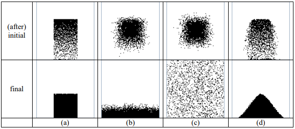
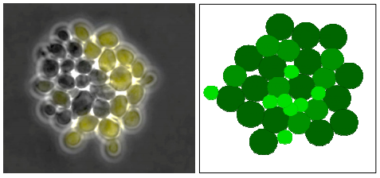

# Concept
Interaction between particles in granular system, mesoscopic clusters of fluid molecules while flowing in a channel, growing cells in biological system, and agents in some complex and artificial environments are basically the same. There are agents, e.g. particles, clusters of molecules, cells, people, and the surrounding environment. Each agent can interact with other agents and also with their environment. For granular and fluid sistems the agents are normally pasive, but for biological and social system they are usually active. More general forms of interaction between different level of agents and environment are proposed in this work, where the system should work for physical, chemical, biological, social, political and any systems of interest.

## A short history
After learning in brief about Molecular Dynamics (MD) method, inventing Single Fluid Volume Element (SFVE) method [[1](#ref1)]
based on Finite Diference (FD) and MD for water flow in self-siphon, doing post-doc about Multi-particle Collision Dynamics (MPCD) [[2](#ref2)], and implementing Agent-Based Model (ABM) for physical system [[3](#ref3)], farming [[4](#ref4)], costumer dynamics [[5](#ref5)], and a very simple traffic flow [[6](#ref6)],  let's say -- a consiousness arose, which induced the birth of ``abm-x``. A granular particle-based simulation, e.g. growth Budding yeast colony [[7](#ref7)], which is studied further using network analysis [[8](#ref8)], could be also simulated, perhaps more simple, using ABM approach, where the physical rules can be simplified to reduce simulation time but sacrifice the details of system evolution, especially the time information.

States of matter using ABM [[3](#ref3)].

Growth of yeast colony as observed experimentally (left) and simulated using MD (right) [[7](#ref7)].

## References
1.  S. Viridi, Novitrian, Nurhayati, W. Hidayat, F. D. E. Latief, F. P. Zen, "Development of single fluid volume element method for simulation of transient fluid flow in self-siphons", AIP Conference Proceedings, vol. 1615, no. 1, pp. 199-207, Sep 2014, url https://doi.org/10.1063/1.4895885
2.  S. Viridi, "Learning MPCD and Other Things", Post-Doc Report, Technische Universität Dortmund, Germany, 2014, url http://dx.doi.org/10.13140/2.1.3523.0725
3.  S. Viridi, F. Haryanto, "Agent-based Model and its Potential in Simulating Some Physical Systems", IOP Conference Series: Materials Science and Engineering, vol. 559, no. 1, p. 012008, Aug 2019, url https://doi.org/10.1088/1757-899X/599/1/012008
4.  S. Viridi, P. Premadi, P. Aditiawati, E. S. Maqdir, T. Suheri, J. Halid, K. N. Sari, U. S. Pasaribu, N. M. Sudaryani, N. Latifah, S. Rahimah, "Simulation of Bioeconomy System using Agent-Based Model in the Case of Smart, Green, and Conventional Farming", IOP Conference Series: Earth and Environmental Science, vol. 230, no. 1, p. 012118, Feb 2019, url https://doi.org/10.1088/1755-1315/230/1/012118
5.  T. Suheri, S. Viridi, "Gravity-Driven Agent-Based Model for Simulation of Economic Growth a Point Along a Highway", IOP Conference Series: Materials Science and Engineering, vol. 662, no. 6, p. 062015, Nov 2019, https://doi.org/10.1088/1757-899X/662/6/062015
6.  S Viridi, M. Dwitasari, M. Takaendengan, K. N. Sari, U. S. Pasaribu, "Traffic flow simulation using agent-based model: A case of single lane with multiple traffic lights and input-output node", Journal of Physics: Conference Series, vol. 1245, no. 1, p. 012011, Aug 2019, url https://doi.org/10.1088/1742-6596/1245/1/012011
7.  D Aprianti, S. N. Khotimah, S. Viridi, "Budding Yeast Colony Growth Study Based on Circular Granular Cell", Journal of Physics: Conference Series, vol. 739, no. 1, p. 012026, Aug 2016, url http://dx.doi.org/10.1088/1742-6596/739/1/012026
8.  Widya Meiriska, F. A. Purnama, D. P. P. Aji, D. Aprianti, S. Viridi, "Network Analysis of Saccharomyces Cerevisiae Colony: Relation between Spatial Position and Generation", Journal of Physics: Conference Series, vol. 1245, no. 1, p. 012006, Aug 2019, url https://doi.org/10.1088/1742-6596/1245/1/012006
