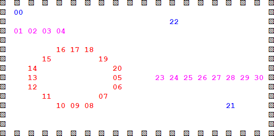
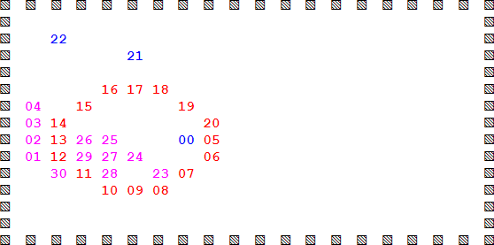

# abm-group
Try https://raw.githack.com/dudung/abm-x/master/src/abm-group/abm-group.html

Two types of object (`Bit` and `Worm`), where the last is aggregate of `Bit` (implementation of abstract class `Agent`), can be moved as shown in Figs 1 and 2. The other object, `Cell`, still has a problem.



Fig 1 Example of initial condition a world consisted of three Bits, two Worms, and one Cell.



Fig 2 A condition after initial condition.

The `Cell` has the form of circle, `Worm` has form of a curved line, and `Bit` is simply a character or a pixel or a bit.

```javascript
function simulate() {
	if(iter > startIter) {
		
		moveBitRandomInWorld(world, b1, b2, b3);
		
		moveWormRandomInWorld(world, w1, w2);
		
		viewWorld(world).inElement(p);
	}
	
	iter++;
	
	if(iter >= maxIter) {
		clearInterval(proc);
	}
}
```

Above code show have the `Bit` and `Worm` are moved randomly in the `world`.
