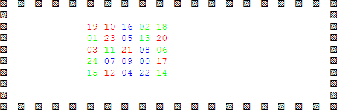
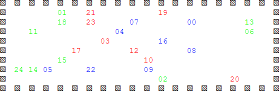

# abm-in-rect
Try https://raw.githack.com/dudung/abm-x/master/src/abm-in-rect/abm-in-rect.html

Spreading of agents in a diffusion-like phenomenon is shown in following Fig 1 and 2.



Fig 1 Intial position of agents.



Fig 2 Final position of agents.

Agents are moving from their initial position, randomly, to their final position.

```javascript
// Move agents
function moveAgent() {
	var agents = arguments[0];
	var world = arguments[1];
	
	var N = agents.length;
	
	for(var k = 0; k < N; k++) {
		var di = Math.round(Math.random() * 2 - 1);
		var dj = Math.round(Math.random() * 2 - 1);
		
		var i = agents[k].x;
		var j = agents[k].y;
		
		// Move src to dest if empty
		if(world[j + dj][i + di] == -1) {
			world[j + dj][i + di] = k;
			world[j][i] = -1;
			agents[k].x = i + di;
			agents[k].y = j + dj;
		}
	}	
}
```

An agent must check first their destination at `world[j + dj][i + di]`, if empty then move value from `world[j][i]` to it, where `di` and `dj` are generated randomly with value `[-1, 0, 1]`.