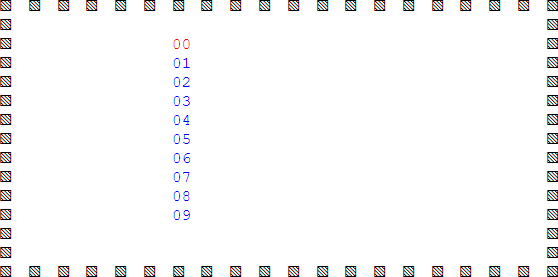
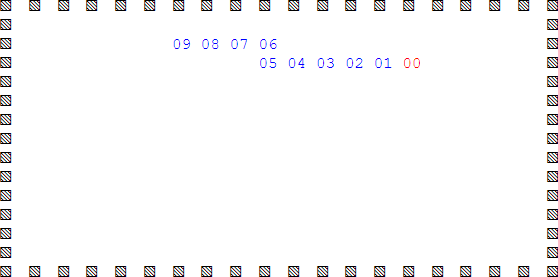
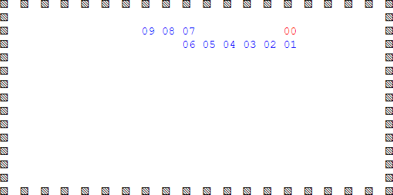
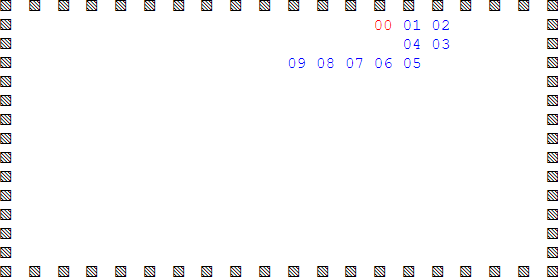

# abm-nibbles
Try https://raw.githack.com/dudung/abm-x/master/src/abm-nibbles/abm-nibbles.html

Direction of the moves is still global from viewer prespective.



Fig 1 Intial position nibbles worm after created.



Fig 2 Worm turns right, down, right.



Fig 3 Worm turns up from previous position.



Fig 4 Worm turns right, up, left from previous position.

Worm head is moved first if the destination cell is empty, then all the other parts followed.

```javascript
// Move worm as connected agents
function moveWorm() {
	var agents = arguments[0];
	var world = arguments[1];
	
	var N = agents.length;
	
	var di, dj;
	var dir = Math.round(Math.random() * 20);
	if(dir <= 9) { di = 1; dj = 0; }
	if(dir == 10) { di = 0; dj = 1; }
	if(dir == 11) { di = 0; dj = -1; }
	if(dir >= 12) { di = -1; dj = 0; }
	
	var k = 0;
	var i = agents[k].x;
	var j = agents[k].y;
	
	// Move src to dest if empty
	if(world[j + dj][i + di] == -1) {
		world[j + dj][i + di] = k;
		world[j][i] = -1;
		agents[k].x = i + di;
		agents[k].y = j + dj;
		
		for(var k = 1; k < N; k++) {
			var i2 = agents[k].x;
			var j2 = agents[k].y;
			
			world[j][i] = k;
			world[j2][i2] = -1;	
			agents[k].x = i;
			agents[k].y = j;

			i = i2;
			j = j2;
		}	
	}
}
```

Move direction is generated randomly. In terms of `(di, dj)`, they are `(1, 0)` move right, `(0, 1)` move up, `(-1, 0)` move left, and `(0, -1)` move down.
