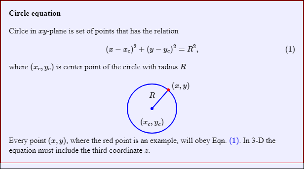

# js-anim-slide
Create a slide using JS

## Slide


Fig 1 Image of created slide for version 20200625, where size of a HTML and two JS files is all about 7 KB, while the image is about 20 KB.

## JS
- Version 20200625 (see the related note)
```javascript
	var slide = new Slide("slide0");
	slide.appendTo(document.body);
	
	slide.setContentDiv(`
	<b>Circle equation</b><br /><br />
	Cirlce in $xy$-plane is set of points that has the relation
	
	\\begin{equation}
	\\label{eqn:circle-equation}
	(x - x_c)^2 + (y - y_c)^2 = R^2,
	\\end{equation}

	where $(x_c, y_c)$ is center point of the circle with radius
	$R$.
	
	<br /><br />
	<center>
	&nbsp;&nbsp;&nbsp;&nbsp;&nbsp;&nbsp;&nbsp;
	&nbsp;&nbsp;&nbsp;&nbsp;&nbsp;&nbsp;&nbsp;
	&nbsp;&nbsp;&nbsp;&nbsp;&nbsp;&nbsp;&nbsp;
	&nbsp;&nbsp;&nbsp;&nbsp;
	$(x, y)$
	</center>
	
	<center>
	$R$
	</center>
	
	<br /><br />
	<center>
	$(x_c, y_c)$
	</center>
	<br />
	
	Every point $(x, y)$, where the red point is an example, will
	obey Eqn. \\eqref{eqn:circle-equation}. In 3-D the equation
	must include the third coordinate $z$.
	`);
	
	slide.setContentCan(`
	cx.lineWidth = 2;
	cx.strokeStyle = "#00f";
	cx.beginPath();
	cx.arc(307, 220, 50, 0, 2 * Math.PI);
	cx.stroke();
	
	cx.strokeStyle = "#00f";
	cx.beginPath();
	cx.moveTo(307, 220);
	cx.lineTo(340, 182);
	cx.stroke();
	
	cx.fillStyle = "#00f";
	cx.beginPath();
	cx.arc(307, 220, 3, 0, 2 * Math.PI);
	cx.fill();
	
	cx.fillStyle = "#f00";
	cx.beginPath();
	cx.arc(340, 182, 3, 0, 2 * Math.PI);
	cx.fill();
	`);
```

## Note
- 20200625 | Equation with MathJax and graphic with Canvas can be shown in a slide with JavaScript only. Interactivity has not yet been developed. Text and graphic are still adjusted manually and not display easily.