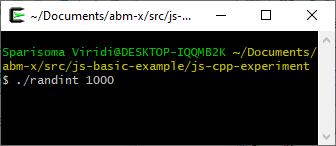
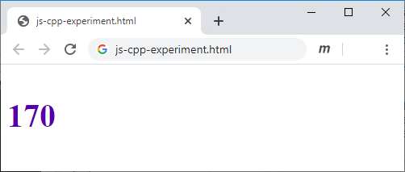

# js-cpp-experiment
Experiment in interaction between JS and C++

## Idea
Monitor a JS file through a browser, where its content will be changed intermittent by a C++ program.

## HTML file
```html
<!doctype html>
<html>
<head>
</head>
<body>
<script src="js-cpp-experiment.js"></script>
</body>
</html>
```

## JS file
```javascript
/*
	js-cpp-experment.js
	Try an interaction between JS and C++
	
	Sparisoma Virid | https://github.com/abm-x
	
	20200529
	1548 Start creating this example.
	1625 It [1] does not work for new created script.
	1627 It [2] also does not work.
	1638 It works with [3], finally.
	1731 Show number and use it as font color.
	
	References
	1. url https://www.jstips.co/en/javascript/detect-document
	   -ready-in-pure-js [20200529].
	2. url https://flaviocopes.com/dom-ready  [20200529].
	3. url https://stackoverflow.com/a/3248500/9475509
	   [20200529].
*/


// Define global variables
var proc, iter, iterMax


// Execute main function
main();


// Define main function
function main() {
	iter = 0;
	iterMax = 1000;
	
	var p = document.createElement("p");
	p.id = "output";
	p.style.fontWeight = "bold";
	p.style.fontSize = "40px";
	document.body.append(p);
	
	document.addEventListener("click", function() {
		clearInterval(proc);
		console.log("Click end the process");
	});
	
	proc = setInterval(read, 1000);
}


// Read the data through a script
function read() {
	var q = document.getElementById("output");
	
	var script = document.createElement("script");
	script.type = "text/javascript";
	script.src = "data.txt";
	script.onload = function() {
		var bb = ("0" + data.toString(16)).slice(-2);
		var rr = 255 - data;
		rr = ("0" + rr.toString(16)).slice(-2);
		q.style.color = "#" + rr + "00" + bb; 
		q.innerHTML = ("00" + data).slice(-3);
	}
	document.body.append(script);
	
	iter++;
	
	script.remove();
	
	if(iter >= iterMax) {
		clearInterval(proc);
		console.log("Maximum iteration achieved");
	}
}
```

## C++ file
```c++
/*
	randint.cpp
	Generate random number for JS reading
	
	Sparisoma Viridi | https://github.com/dudung/abm-x
	
	Compile: g++ randint.cpp -o randint
	Execute: ./randint [N]
	
	20200529
	1646 Start this C++ program.
	1701 Try this [1] for slowing the output.
	1707 Play again with [3].
	1711 Does not work with console pipe |.
	
	References
	1. url https://stackoverflow.com/a/42045893/9475509
	2. url https://en.cppreference.com/w/cpp/thread/sleep_for
	   [20200529].
	3. url http://www.cplusplus.com/reference/cstdlib/rand/
	   [20200529].	
*/

#include <iostream>
#include <chrono>
#include <thread>
#include <cstdlib>
#include <fstream>

using namespace std;

int main(int argc, char *argv[]) {
	int N = 5;
	if(argc > 1) {
		N = atoi(argv[1]);
	}
	
	int i = 0;
	while(i < N) {
		int j = rand() % 256;
		
		ofstream fout;
		fout.open("data.txt");
		fout << "var data = " << j << ";" << endl;
		fout.close();
				
		this_thread::sleep_for(1s);
		i++;
	}
	
	return 0;
}
```

## Results



Fig 1 C++ program to generate random number in `data.txt` file.



Fig 2 HTML + JS that observe `data.txt` file, read it through script when ready, and use it for number with color.