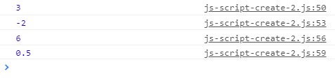

# js-script-create-2
Explore HTML DOM element `script`

## Note
Try to resolve the failed of [js-script-create](../js-script-create)

## HTML files
```html
<!doctype html>
<html>
<head>
</head>
<body>
<script src="js-script-create-2.js"></script>
</body>
</html>
```

## JS files -- included script add()
```javascript
function add(a, b) {
	return a + b;
}
```

## JS files -- included script sub()
```javascript
function sub(a, b) {
	return a - b;
}
```

## JS files -- included script mul()
```javascript
function mul(a, b) {
	return a * b;
}
```

## JS files -- included script div()
```javascript
function div(a, b) {
	return a / b;
}
```

## JS files
```javascript
/*
	js-script-create-2.js
	Explore HTML DOM element script
	
	Sparisoma Virid | https://github.com/abm-x
	
	20200601
	2133 Continue the failed js-script-create.
	2210 Can upload the script but not so modular.
	2211 It still requires global parameters.
*/

var fname = [
	"scriptAdd.js",
	"scriptSub.js",
	"scriptMul.js",
	"scriptDiv.js"
];


// Execute premain function
premain();

// Define main function
function premain() {
	N = fname.length;
	i = 0;
	
	loadScripts();
}

function loadScripts() {
	var script = document.createElement("script");
	script.src = fname[i];
	document.body.append(script);
	
	script.onload = function() {
		i++;
		if(i < N) {
			loadScripts();
		} else {
			main();
		}
	}
}


function main() {
	var a = add(1, 2);
	console.log(a);
	
	var b = sub(5, 7);
	console.log(b);
	
	var c = mul(1.5, 4);
	console.log(c);
	
	var d = div(4, 8);
	console.log(d);
}
```

## Result


It can load script succesfully but not in so modular way. It still requires two global variables, i.e. `i` for index and `fname` for script filename.