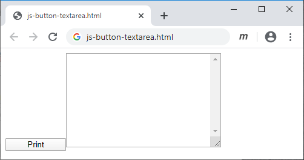
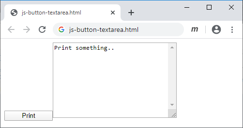
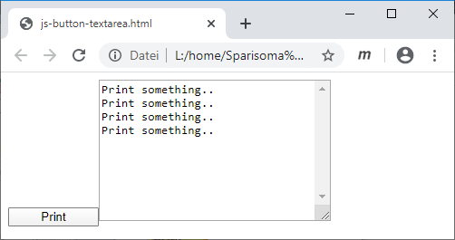

# js-button-textarea
Create and display a button and a textarea, and show message in the textarea when the button is clicked

## HTML file
```html
<!doctype html>
<html>
<head>
</head>
<body>
<script src="js-button-textarea.js"></script>
</body>
</html>
```

## JS file
```javascript
/*
	js-button-textarea.js
	Button and textarea interaction, two HTML DOM element objects
	
	Sparisoma Virid | https://github.com/abm-x
	
	20200525
	2041 Create this example.
	2058 Fix the code and ti works.
	2108 Document it.
	
	References
	1. url https://www.w3schools.com/jsref/dom_obj_all.asp
	   [20200525].
*/


// Execute main function
main();


// Define main function
function main() {
	// Create a button and a textarea
	var btn = document.createElement("button");
	var ta = document.createElement("textarea");
	
	// Append created element to document body
	document.body.append(btn);
	document.body.append(ta);
	
	// Set style for the elements
	btn.style.width = "100px";
	btn.innerHTML = "Print";
	
	ta.style.width = "250px";
	ta.style.height = "150px";
	ta.style.overflowY = "scroll";
	
	// Create a string for storing messages
	var str = "Print something..";
	
	// Register click event to the button and executed function
	btn.addEventListener("click", function() {
		printOnString(ta, str);
	});
}


// Print on an element a string
function printOnString() {
	var t = arguments[0];
	var s = arguments[1];
	t.value = s;
}
```

## Result


Fig 1 A button and a textarea elements are displayed.



Fig 2 A message is displayed in the textarea after the button is clicked.

## Exercise
1. Change the button caption with `Show message`.
2. Modify the output message in textarea `This is the output message`.
3. Create the second button that show different message in textarea than the first one.
4. Modify the code so that every time the button is clicked, new message is added to textarea below the previous one.

5. Try to imagine an action that will fired related to textarea when a button is clicked based on your recent knowledge with JS.