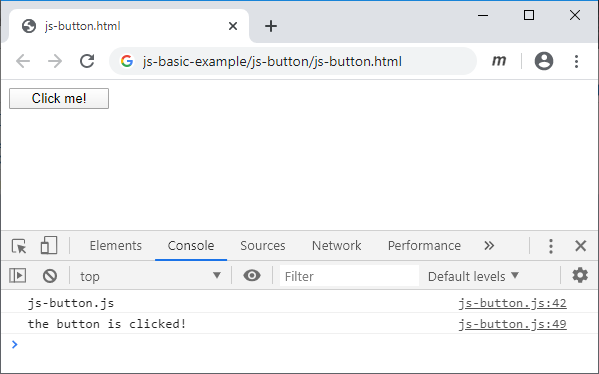

# js-button
Create and display a button, and show message in JS console when clicked

## HTML file
```html
<!doctype html>
<html>
<head>
</head>
<body>
<script src="js-button.js"></script>
</body>
</html>
```

## JS file
```javascript
/*
	js-button.js
	Create and view buttton element
	
	Sparisoma Virid | https://github.com/abm-x
	
	20200525
	1827 Create this example.
	1956 Test and make documentation.
	2009 Finish documentation.
	2024 Finish exercise.
	
	References
	1. url https://www.w3schools.com/jsref/dom_obj_all.asp
	   [20200525].
*/


// Execute main function
main();


// Define main function
function main() {
	// Create a button, a HTML DOM element object
	var btn = document.createElement("button");
	
	// Append created element to document body
	document.body.append(btn);
	
	// Set some style
	btn.style.width = "100px";
	
	// Create a string for storing messages
	var str = "Click me!";
	
	// Display the string as button caption
	btn.innerHTML = str;
	
	// Register click event to the button and executed function
	btn.addEventListener("click", btnClicked);
	
	// Display message in JS console
	console.log("js-button.js");
}


// Function executed when the button is clicked
function btnClicked() {
	// Display message in JS console
	console.log("the button is clicked!");
}
```

## Result


Fig 1 A button with `Click me!` caption is created and then displayed.



Fig 2 The message `the button is clicked!` is displayed in JS console when the button is clicked.

## Exercise
1. Change the button caption with `Print Message`.
2. Modify the code to produce message in JS console `This message is shown after a button is clicked`.
3. Create the second button that show different message in JS console than the first one.
4. With two button, make a code that one button will change the caption of the other.
5. Imagine an action that will fired when a button is clicked based on your recent knowledge with JS.