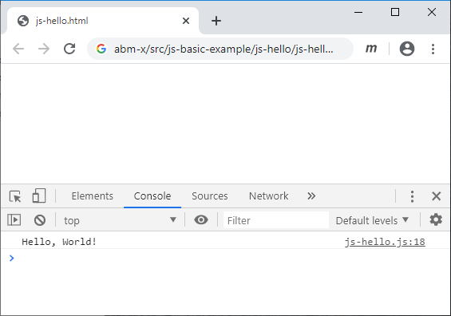

# js-hello
Show "Hello, World!" in JS console of a web browser

## HTML file
```html
<!doctype html>
<html>
<head>
</head>
<body>
<script src="js-hello.js"></script>
</body>
</html>
```

## JS file
```javascript
/*
	js-hello.js-hello
	Display message "Hello, World!" in JS console
	
	Sparisoma Virid | https://github.com/abm-x
	
	20200525
	1002 Create this example.
*/


// Execute main function
main();


// Define main function
function main() {
	
	// Display message in JS console
	console.log("Hello, World!");
}
```

## Result


## Question
1. Change the previous JS code to produce "Hello, Your-Name!" in JS console of an internet browser application. Use your own name as `Your-Name`.
2. Use following lines
```javascript
console.log("One, two, three\n");
console.log("One sees a tree\n");
console.log("Four, five six\nLet's do the mix");
```
	in your JS code. Explain about the result.

3. What is the purpose of character `\n` while using `console.log()` in previous question?

4. What is the shortcut to show JS console in Google Chrome?

5. Make a code to produce following result
```
A
BB
CCC
DDDD
EEEEE
```
as simple as possible. Do not use array or iteration.