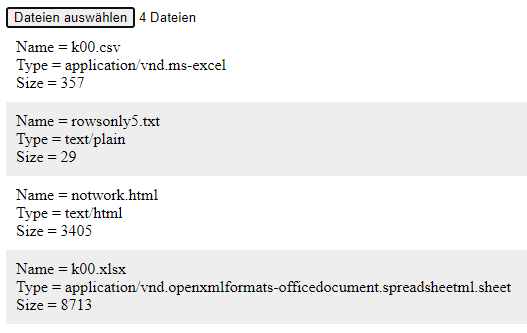

# js-input-file
Explore HTML DOM element `input` with type file

## HTML file
```html
<!doctype html>
<html>
<head>
</head>
<body>
<script src="js-input-file.js"></script>
</body>
</html>
```

## JS file
```javascript
/*
	js-input-file.js
	Use input file to read file information
	
	Sparisoma Virid | https://github.com/abm-x
	
	20200601
	1534 Create this example.
	1607 Test input file [1] and it works.
	1619 Finish the example.
	
	References
	1. url https://www.w3schools.com/jsref/dom_obj_fileupload.asp
	   [20200601].
*/


// Execute main function
main();


// Define main function
function main() {
	// Create HTML DOM element
	var inf = document.createElement("input");
	inf.type = "file";
	inf.multiple = "multiple";
	document.body.append(inf);
	
	// Call a function when it is changed
	inf.addEventListener("change", report);
}


// Report something
function report() {
	// Get event, which is the first argument
	var e = arguments[0];
	
	// Get the filelist
	var fileList = e.target.files;
	
	// Create element for each file information
	var N = fileList.length;
	for(var i = 0; i < N; i++) {
		var el = document.createElement("div");
		el.style.padding = "10px";
		if(i % 2 == 1) {
			el.style.background = "#eee";
		}
		document.body.append(el);
		
		var content = "";
		
		content += "Name = " + fileList[i].name + "<br />";
		content += "Type = " + fileList[i].type + "<br />";
		content += "Size = " + fileList[i].size;
		
		el.innerHTML = content;
	}
}
```

## Result

