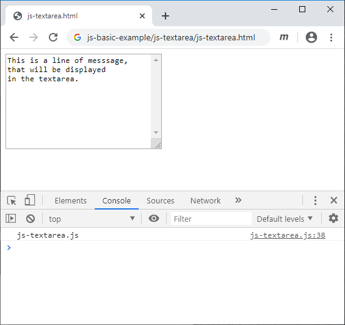

# js-textarea
Create and display textarea element

## HTML file
```html
<!doctype html>
<html>
<head>
</head>
<body>
<script src="js-textarea.js"></script>
</body>
</html>
```

## JS file
```javascript
/*
	js-textarea.js
	Create and view textarea element
	
	Sparisoma Virid | https://github.com/abm-x
	
	20200525
	1709 Create this example.
	
	References
	1. url https://www.w3schools.com/jsref/dom_obj_all.asp
	   [20200525].
*/


// Execute main function
main();


// Define main function
function main() {
	// Create a textarea, a HTML DOM element object
	var ta = document.createElement("textarea");
	
	// Append created element to document body
	document.body.append(ta);
	
	// Set some style
	ta.style.width = "250px";
	ta.style.height = "150px";
	ta.style.overflowY = "scroll";
	
	// Create a string for storing messages
	var str = "This is a line of messsage,\n";
	str += "that will be displayed\n";
	str += "in the textarea.";
	
	// Display the string the textarea
	ta.value = str;
	
	// Display message in JS console
	console.log("js-textarea.js");
}
```

## Result


## Exercise
1. In the previous figure there is still a message in JS console. Is that necessary?
2. Change the diplay text with your own text.
3. Change size of the textarea.
4. Try to change background of the textarea.
5. Add this text the textarea

```
A day in a week
	
Two days in a month
	
And the rest..
```