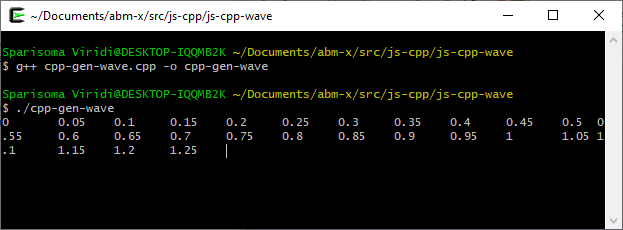
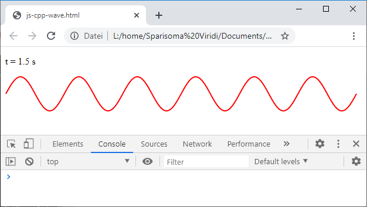
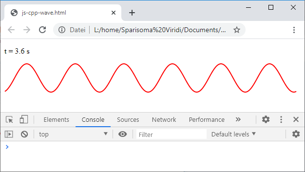
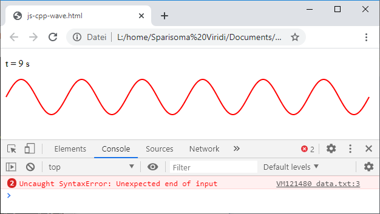

# js-cpp-wave
Create JSON data using a C++ program and show it using JS in a web browser

## C++ file
```c++
/*
	cpp-gen-wave.cpp
	Generate random number for JS reading
	
	Sparisoma Viridi | https://github.com/dudung/abm-x
	
	Compile: g++ cpp-gen-wave.cpp -o cpp-gen-wave
	Execute: ./cpp-gen-wave
	
	20200529
	2007 Derive it from randint.cpp file.
	2047 Clear the streamstring [1].
	2116 Finish producing wave profile.
	2123 Add time stamp in the beginning of data.
	2146 Change format to JSON manually.
	2151 Corret JSON output, remove last semicolon.
	2218 Change delay to 0.1 s and test it.
	2221 Find problem with the last comma in array.
	2239 Fix range dependent wavelength.
	2251 Problem not until final time tend.
	
	References
	1. https://stackoverflow.com/a/2848109/9475509
*/

#include <iostream>
#include <chrono>
#include <thread>
#include <cstdlib>
#include <fstream>
#include <cmath>
#include <sstream>

using namespace std;

int main(int argc, char *argv[]) {
	// Prepare stringstream
	stringstream sout;
	stringstream xout;
	stringstream yout;
	
	// Define wave parameters
	double A = 0.1;       // m
	double T = 0.5;       // s
	double lambda = 1.0;  // main
	double phi0 = 0;      // rad
	
	// Calculate other parameters
	double omega = 2 *  M_PI / T;
	double k = 2 * M_PI / lambda;
	
	// Define ranges
	double xmin = 0;
	double xmax = xmin + 6 * lambda;
	double dx = 0.01 * lambda;
	int Nx = round((xmax - xmin) / dx);
	double tmin = 0;
	double tmax = tmin + 20 * T;
	double dt = 0.1 * T;
	
	// Initiate time
	double t = tmin;
	while(t <= tmax) {
		
		// Clear stringstream
		sout.str(string());
		sout.clear();
		xout.str(string());
		xout.clear();
		yout.str(string());
		yout.clear();
		
		// Begin JSON format
		sout << "var data =`{" << endl;
		
		// Add time information
		sout << "\"t\": " << t << "," << endl;
		
		// Begin array
		xout << "\"x\": [";
		yout << "\"y\": [";
		
		// Initiate position
		double x = xmin;
		int ix = 0;
		while(ix <= Nx) {
			x = xmin + ix * dx;
			
			// Calculate wave data
			double y = A * sin(k * x - omega * t + phi0);
			
			// Add content data
			xout << x;
			yout << y;
			
			if(ix < Nx) {
				xout << ", ";
				yout << ", ";
			}
			
			// Advance position
			ix++;
		}
		
		// End array
		xout << "]";
		yout << "]";
		
		// Add array
		sout << xout.str() << "," << endl;
		sout << yout.str() << endl;
		
		// End JSON format
		sout << "}`" << endl;
		
		// Write data to file
		ofstream fout;
		fout.open("data.txt");
		fout << sout.str();
		fout.close();
		
		// Display on console
		cout << t << "\t";
		cout.flush();
		
		// Delay
		this_thread::sleep_for(0.1s);
		
		// Advance time
		t += dt;
	}
	
	// Terminate program
	return 0;
}
```

## JSON file
```json
var data =`{
"t": 9.95,
"x": [0, 0.01, 0.02, 0.03, 0.04, 0.05, 0.06, 0.07, 0.08, 0.09, 0.1, 0.11, 0.12, 0.13, 0.14, 0.15, 0.16, 0.17, 0.18, 0.19, 0.2, 0.21, 0.22, 0.23, 0.24, 0.25, 0.26, 0.27, 0.28, 0.29, 0.3, 0.31, 0.32, 0.33, 0.34, 0.35, 0.36, 0.37, 0.38, 0.39, 0.4, 0.41, 0.42, 0.43, 0.44, 0.45, 0.46, 0.47, 0.48, 0.49, 0.5, 0.51, 0.52, 0.53, 0.54, 0.55, 0.56, 0.57, 0.58, 0.59, 0.6, 0.61, 0.62, 0.63, 0.64, 0.65, 0.66, 0.67, 0.68, 0.69, 0.7, 0.71, 0.72, 0.73, 0.74, 0.75, 0.76, 0.77, 0.78, 0.79, 0.8, 0.81, 0.82, 0.83, 0.84, 0.85, 0.86, 0.87, 0.88, 0.89, 0.9, 0.91, 0.92, 0.93, 0.94, 0.95, 0.96, 0.97, 0.98, 0.99, 1, 1.01, 1.02, 1.03, 1.04, 1.05, 1.06, 1.07, 1.08, 1.09, 1.1, 1.11, 1.12, 1.13, 1.14, 1.15, 1.16, 1.17, 1.18, 1.19, 1.2, 1.21, 1.22, 1.23, 1.24, 1.25, 1.26, 1.27, 1.28, 1.29, 1.3, 1.31, 1.32, 1.33, 1.34, 1.35, 1.36, 1.37, 1.38, 1.39, 1.4, 1.41, 1.42, 1.43, 1.44, 1.45, 1.46, 1.47, 1.48, 1.49, 1.5, 1.51, 1.52, 1.53, 1.54, 1.55, 1.56, 1.57, 1.58, 1.59, 1.6, 1.61, 1.62, 1.63, 1.64, 1.65, 1.66, 1.67, 1.68, 1.69, 1.7, 1.71, 1.72, 1.73, 1.74, 1.75, 1.76, 1.77, 1.78, 1.79, 1.8, 1.81, 1.82, 1.83, 1.84, 1.85, 1.86, 1.87, 1.88, 1.89, 1.9, 1.91, 1.92, 1.93, 1.94, 1.95, 1.96, 1.97, 1.98, 1.99, 2, 2.01, 2.02, 2.03, 2.04, 2.05, 2.06, 2.07, 2.08, 2.09, 2.1, 2.11, 2.12, 2.13, 2.14, 2.15, 2.16, 2.17, 2.18, 2.19, 2.2, 2.21, 2.22, 2.23, 2.24, 2.25, 2.26, 2.27, 2.28, 2.29, 2.3, 2.31, 2.32, 2.33, 2.34, 2.35, 2.36, 2.37, 2.38, 2.39, 2.4, 2.41, 2.42, 2.43, 2.44, 2.45, 2.46, 2.47, 2.48, 2.49, 2.5, 2.51, 2.52, 2.53, 2.54, 2.55, 2.56, 2.57, 2.58, 2.59, 2.6, 2.61, 2.62, 2.63, 2.64, 2.65, 2.66, 2.67, 2.68, 2.69, 2.7, 2.71, 2.72, 2.73, 2.74, 2.75, 2.76, 2.77, 2.78, 2.79, 2.8, 2.81, 2.82, 2.83, 2.84, 2.85, 2.86, 2.87, 2.88, 2.89, 2.9, 2.91, 2.92, 2.93, 2.94, 2.95, 2.96, 2.97, 2.98, 2.99, 3, 3.01, 3.02, 3.03, 3.04, 3.05, 3.06, 3.07, 3.08, 3.09, 3.1, 3.11, 3.12, 3.13, 3.14, 3.15, 3.16, 3.17, 3.18, 3.19, 3.2, 3.21, 3.22, 3.23, 3.24, 3.25, 3.26, 3.27, 3.28, 3.29, 3.3, 3.31, 3.32, 3.33, 3.34, 3.35, 3.36, 3.37, 3.38, 3.39, 3.4, 3.41, 3.42, 3.43, 3.44, 3.45, 3.46, 3.47, 3.48, 3.49, 3.5, 3.51, 3.52, 3.53, 3.54, 3.55, 3.56, 3.57, 3.58, 3.59, 3.6, 3.61, 3.62, 3.63, 3.64, 3.65, 3.66, 3.67, 3.68, 3.69, 3.7, 3.71, 3.72, 3.73, 3.74, 3.75, 3.76, 3.77, 3.78, 3.79, 3.8, 3.81, 3.82, 3.83, 3.84, 3.85, 3.86, 3.87, 3.88, 3.89, 3.9, 3.91, 3.92, 3.93, 3.94, 3.95, 3.96, 3.97, 3.98, 3.99, 4, 4.01, 4.02, 4.03, 4.04, 4.05, 4.06, 4.07, 4.08, 4.09, 4.1, 4.11, 4.12, 4.13, 4.14, 4.15, 4.16, 4.17, 4.18, 4.19, 4.2, 4.21, 4.22, 4.23, 4.24, 4.25, 4.26, 4.27, 4.28, 4.29, 4.3, 4.31, 4.32, 4.33, 4.34, 4.35, 4.36, 4.37, 4.38, 4.39, 4.4, 4.41, 4.42, 4.43, 4.44, 4.45, 4.46, 4.47, 4.48, 4.49, 4.5, 4.51, 4.52, 4.53, 4.54, 4.55, 4.56, 4.57, 4.58, 4.59, 4.6, 4.61, 4.62, 4.63, 4.64, 4.65, 4.66, 4.67, 4.68, 4.69, 4.7, 4.71, 4.72, 4.73, 4.74, 4.75, 4.76, 4.77, 4.78, 4.79, 4.8, 4.81, 4.82, 4.83, 4.84, 4.85, 4.86, 4.87, 4.88, 4.89, 4.9, 4.91, 4.92, 4.93, 4.94, 4.95, 4.96, 4.97, 4.98, 4.99, 5, 5.01, 5.02, 5.03, 5.04, 5.05, 5.06, 5.07, 5.08, 5.09, 5.1, 5.11, 5.12, 5.13, 5.14, 5.15, 5.16, 5.17, 5.18, 5.19, 5.2, 5.21, 5.22, 5.23, 5.24, 5.25, 5.26, 5.27, 5.28, 5.29, 5.3, 5.31, 5.32, 5.33, 5.34, 5.35, 5.36, 5.37, 5.38, 5.39, 5.4, 5.41, 5.42, 5.43, 5.44, 5.45, 5.46, 5.47, 5.48, 5.49, 5.5, 5.51, 5.52, 5.53, 5.54, 5.55, 5.56, 5.57, 5.58, 5.59, 5.6, 5.61, 5.62, 5.63, 5.64, 5.65, 5.66, 5.67, 5.68, 5.69, 5.7, 5.71, 5.72, 5.73, 5.74, 5.75, 5.76, 5.77, 5.78, 5.79, 5.8, 5.81, 5.82, 5.83, 5.84, 5.85, 5.86, 5.87, 5.88, 5.89, 5.9, 5.91, 5.92, 5.93, 5.94, 5.95, 5.96, 5.97, 5.98, 5.99, 6],
"y": [0.0587785, 0.0637424, 0.0684547, 0.0728969, 0.0770513, 0.0809017, 0.0844328, 0.0876307, 0.0904827, 0.0929776, 0.0951057, 0.0968583, 0.0982287, 0.0992115, 0.0998027, 0.1, 0.0998027, 0.0992115, 0.0982287, 0.0968583, 0.0951057, 0.0929776, 0.0904827, 0.0876307, 0.0844328, 0.0809017, 0.0770513, 0.0728969, 0.0684547, 0.0637424, 0.0587785, 0.0535827, 0.0481754, 0.0425779, 0.0368125, 0.0309017, 0.024869, 0.0187381, 0.0125333, 0.00627905, 7.69363e-15, -0.00627905, -0.0125333, -0.0187381, -0.024869, -0.0309017, -0.0368125, -0.0425779, -0.0481754, -0.0535827, -0.0587785, -0.0637424, -0.0684547, -0.0728969, -0.0770513, -0.0809017, -0.0844328, -0.0876307, -0.0904827, -0.0929776, -0.0951057, -0.0968583, -0.0982287, -0.0992115, -0.0998027, -0.1, -0.0998027, -0.0992115, -0.0982287, -0.0968583, -0.0951057, -0.0929776, -0.0904827, -0.0876307, -0.0844328, -0.0809017, -0.0770513, -0.0728969, -0.0684547, -0.0637424, -0.0587785, -0.0535827, -0.0481754, -0.0425779, -0.0368125, -0.0309017, -0.024869, -0.0187381, -0.0125333, -0.00627905, -7.3506e-15, 0.00627905, 0.0125333, 0.0187381, 0.024869, 0.0309017, 0.0368125, 0.0425779, 0.0481754, 0.0535827, 0.0587785, 0.0637424, 0.0684547, 0.0728969, 0.0770513, 0.0809017, 0.0844328, 0.0876307, 0.0904827, 0.0929776, 0.0951057, 0.0968583, 0.0982287, 0.0992115, 0.0998027, 0.1, 0.0998027, 0.0992115, 0.0982287, 0.0968583, 0.0951057, 0.0929776, 0.0904827, 0.0876307, 0.0844328, 0.0809017, 0.0770513, 0.0728969, 0.0684547, 0.0637424, 0.0587785, 0.0535827, 0.0481754, 0.0425779, 0.0368125, 0.0309017, 0.024869, 0.0187381, 0.0125333, 0.00627905, 7.00758e-15, -0.00627905, -0.0125333, -0.0187381, -0.024869, -0.0309017, -0.0368125, -0.0425779, -0.0481754, -0.0535827, -0.0587785, -0.0637424, -0.0684547, -0.0728969, -0.0770513, -0.0809017, -0.0844328, -0.0876307, -0.0904827, -0.0929776, -0.0951057, -0.0968583, -0.0982287, -0.0992115, -0.0998027, -0.1, -0.0998027, -0.0992115, -0.0982287, -0.0968583, -0.0951057, -0.0929776, -0.0904827, -0.0876307, -0.0844328, -0.0809017, -0.0770513, -0.0728969, -0.0684547, -0.0637424, -0.0587785, -0.0535827, -0.0481754, -0.0425779, -0.0368125, -0.0309017, -0.024869, -0.0187381, -0.0125333, -0.00627905, -8.08564e-15, 0.00627905, 0.0125333, 0.0187381, 0.024869, 0.0309017, 0.0368125, 0.0425779, 0.0481754, 0.0535827, 0.0587785, 0.0637424, 0.0684547, 0.0728969, 0.0770513, 0.0809017, 0.0844328, 0.0876307, 0.0904827, 0.0929776, 0.0951057, 0.0968583, 0.0982287, 0.0992115, 0.0998027, 0.1, 0.0998027, 0.0992115, 0.0982287, 0.0968583, 0.0951057, 0.0929776, 0.0904827, 0.0876307, 0.0844328, 0.0809017, 0.0770513, 0.0728969, 0.0684547, 0.0637424, 0.0587785, 0.0535827, 0.0481754, 0.0425779, 0.0368125, 0.0309017, 0.024869, 0.0187381, 0.0125333, 0.00627905, 7.74262e-15, -0.00627905, -0.0125333, -0.0187381, -0.024869, -0.0309017, -0.0368125, -0.0425779, -0.0481754, -0.0535827, -0.0587785, -0.0637424, -0.0684547, -0.0728969, -0.0770513, -0.0809017, -0.0844328, -0.0876307, -0.0904827, -0.0929776, -0.0951057, -0.0968583, -0.0982287, -0.0992115, -0.0998027, -0.1, -0.0998027, -0.0992115, -0.0982287, -0.0968583, -0.0951057, -0.0929776, -0.0904827, -0.0876307, -0.0844328, -0.0809017, -0.0770513, -0.0728969, -0.0684547, -0.0637424, -0.0587785, -0.0535827, -0.0481754, -0.0425779, -0.0368125, -0.0309017, -0.024869, -0.0187381, -0.0125333, -0.00627905, -7.39959e-15, 0.00627905, 0.0125333, 0.0187381, 0.024869, 0.0309017, 0.0368125, 0.0425779, 0.0481754, 0.0535827, 0.0587785, 0.0637424, 0.0684547, 0.0728969, 0.0770513, 0.0809017, 0.0844328, 0.0876307, 0.0904827, 0.0929776, 0.0951057, 0.0968583, 0.0982287, 0.0992115, 0.0998027, 0.1, 0.0998027, 0.0992115, 0.0982287, 0.0968583, 0.0951057, 0.0929776, 0.0904827, 0.0876307, 0.0844328, 0.0809017, 0.0770513, 0.0728969, 0.0684547, 0.0637424, 0.0587785, 0.0535827, 0.0481754, 0.0425779, 0.0368125, 0.0309017, 0.024869, 0.0187381, 0.0125333, 0.00627905, 7.05657e-15, -0.00627905, -0.0125333, -0.0187381, -0.024869, -0.0309017, -0.0368125, -0.0425779, -0.0481754, -0.0535827, -0.0587785, -0.0637424, -0.0684547, -0.0728969, -0.0770513, -0.0809017, -0.0844328, -0.0876307, -0.0904827, -0.0929776, -0.0951057, -0.0968583, -0.0982287, -0.0992115, -0.0998027, -0.1, -0.0998027, -0.0992115, -0.0982287, -0.0968583, -0.0951057, -0.0929776, -0.0904827, -0.0876307, -0.0844328, -0.0809017, -0.0770513, -0.0728969, -0.0684547, -0.0637424, -0.0587785, -0.0535827, -0.0481754, -0.0425779, -0.0368125, -0.0309017, -0.024869, -0.0187381, -0.0125333, -0.00627905, -8.13463e-15, 0.00627905, 0.0125333, 0.0187381, 0.024869, 0.0309017, 0.0368125, 0.0425779, 0.0481754, 0.0535827, 0.0587785, 0.0637424, 0.0684547, 0.0728969, 0.0770513, 0.0809017, 0.0844328, 0.0876307, 0.0904827, 0.0929776, 0.0951057, 0.0968583, 0.0982287, 0.0992115, 0.0998027, 0.1, 0.0998027, 0.0992115, 0.0982287, 0.0968583, 0.0951057, 0.0929776, 0.0904827, 0.0876307, 0.0844328, 0.0809017, 0.0770513, 0.0728969, 0.0684547, 0.0637424, 0.0587785, 0.0535827, 0.0481754, 0.0425779, 0.0368125, 0.0309017, 0.024869, 0.0187381, 0.0125333, 0.00627905, 7.7916e-15, -0.00627905, -0.0125333, -0.0187381, -0.024869, -0.0309017, -0.0368125, -0.0425779, -0.0481754, -0.0535827, -0.0587785, -0.0637424, -0.0684547, -0.0728969, -0.0770513, -0.0809017, -0.0844328, -0.0876307, -0.0904827, -0.0929776, -0.0951057, -0.0968583, -0.0982287, -0.0992115, -0.0998027, -0.1, -0.0998027, -0.0992115, -0.0982287, -0.0968583, -0.0951057, -0.0929776, -0.0904827, -0.0876307, -0.0844328, -0.0809017, -0.0770513, -0.0728969, -0.0684547, -0.0637424, -0.0587785, -0.0535827, -0.0481754, -0.0425779, -0.0368125, -0.0309017, -0.024869, -0.0187381, -0.0125333, -0.00627905, -7.44858e-15, 0.00627905, 0.0125333, 0.0187381, 0.024869, 0.0309017, 0.0368125, 0.0425779, 0.0481754, 0.0535827, 0.0587785, 0.0637424, 0.0684547, 0.0728969, 0.0770513, 0.0809017, 0.0844328, 0.0876307, 0.0904827, 0.0929776, 0.0951057, 0.0968583, 0.0982287, 0.0992115, 0.0998027, 0.1, 0.0998027, 0.0992115, 0.0982287, 0.0968583, 0.0951057, 0.0929776, 0.0904827, 0.0876307, 0.0844328, 0.0809017, 0.0770513, 0.0728969, 0.0684547, 0.0637424, 0.0587785, 0.0535827, 0.0481754, 0.0425779, 0.0368125, 0.0309017, 0.024869, 0.0187381, 0.0125333, 0.00627905, 7.10555e-15, -0.00627905, -0.0125333, -0.0187381, -0.024869, -0.0309017, -0.0368125, -0.0425779, -0.0481754, -0.0535827, -0.0587785, -0.0637424, -0.0684547, -0.0728969, -0.0770513, -0.0809017, -0.0844328, -0.0876307, -0.0904827, -0.0929776, -0.0951057, -0.0968583, -0.0982287, -0.0992115, -0.0998027, -0.1, -0.0998027, -0.0992115, -0.0982287, -0.0968583, -0.0951057, -0.0929776, -0.0904827, -0.0876307, -0.0844328, -0.0809017, -0.0770513, -0.0728969, -0.0684547, -0.0637424, -0.0587785, -0.0535827, -0.0481754, -0.0425779, -0.0368125, -0.0309017, -0.024869, -0.0187381, -0.0125333, -0.00627905, -6.76253e-15, 0.00627905, 0.0125333, 0.0187381, 0.024869, 0.0309017, 0.0368125, 0.0425779, 0.0481754, 0.0535827, 0.0587785]
}`
```


## HTML file
```html
<!doctype html>
<!--
	js-cpp-wave.html
	Show wave using JS with data produced by a C++ program
	
	Sparisoma Viridi | https://github.com/dudung/abm-x
	
	20200529
	1959 Start this from js-cpp-experiment.js file.
-->
<html>
<head>
</head>
<body>
<script src="js-show-wave.js"></script>
</body>
</html>
```

## JS file
```javascript
/*
	js-show-wave.js
	Show wave data produced by cpp-gen-wave.cpp file
	
	Sparisoma Virid | https://github.com/abm-x
	
	20200529
	2005 Derive it from js-cpp-experment.js file.
	2146 View first string of JSON from data.txt file.
	2232 Get error Uncaught SyntaxError: Unexpected end of input.
	2235 Correct xrange from waveCurve.
	2244 Can avoid error message using [1], but not understand.
	2246 The error comes back.
	
	References
	1. url https://www.w3schools.com/js/js_errors.asp
	  [20200529].
*/


// Define global variables
var proc, iter, iterMax


// Execute main function
main();


// Define main function
function main() {
	iter = 0;
	iterMax = 10000;
	
	var p = document.createElement("p");
	p.id = "outText";
	document.body.append(p);
	
	var c = document.createElement("canvas");
	c.id = "outCanvas";
	c.width = "600";
	c.height = "60";
	c.style.width = c.width + "px";
	c.style.height = c.height + "px";
	c.style.background = "#fff";
	c.style.border = "#fff 0px solid";
	document.body.append(c);
	
	document.addEventListener("click", function() {
		clearInterval(proc);
		console.log("Click end the process");
	});
	
	proc = setInterval(read, 50);
}


// Read the data through a script
function read() {
	var q = document.getElementById("outText");
	var d = document.getElementById("outCanvas");
	
	var script = document.createElement("script");
	script.type = "text/javascript";
	script.src = "data.txt";
	script.onload = function() {
		
		try {
			var waveCurve = JSON.parse(data);
			clear(d);
			draw(d, waveCurve);
			
			q.innerHTML = "t = " + waveCurve.t + " s";
		} catch(err) {
			console.log(err);
			console.log(data);
		}
		
	}
	document.body.append(script);
	
	iter++;
	
	script.remove();
	
	if(iter >= iterMax) {
		clearInterval(proc);
		console.log("Maximum iteration achieved");
	}
}


// Draw wave on canvas
function draw() {
	var c = arguments[0];
	var w = arguments[1];
	var cx = c.getContext("2d");
	
	var x = w.x;
	var y = w.y;
	var N = x.length;
	
	cx.strokeStyle = "#f00";
	cx.lineWidth = 2;
	cx.beginPath();
	for(var i = 0; i < N; i++) {
		var xi = x[i];
		var yi = y[i];
		var TR = tr(xi, yi);
		var X = TR[0];
		var Y = TR[1];
		
		if(i == 0) {
			cx.moveTo(X, Y);
		} else {
			cx.lineTo(X, Y);
		}
	}
	cx.stroke();
	
	function tr() {
		var XMIN = 1;
		var XMAX = parseInt(c.width) - 1;
		var YMIN = parseInt(c.height) - 1;
		var YMAX = 1;
			
		var xmin = w.x[0];
		var xmax = w.x[w.x.length - 1];
		var ymin = -0.1;
		var ymax = 0.1;
		
		var xx = arguments[0];
		var yy = arguments[1];
		
		var XX = (xx - xmin) / (xmax - xmin);
		XX *= (XMAX - XMIN);
		XX += XMIN;
		
		var YY = (yy - ymin) / (ymax - ymin);
		YY *= (YMAX - YMIN);
		YY += YMIN;
		
		return [XX, YY];
	}
}

// Clear canvas
function clear() {
	var c = arguments[0];
	var LX = parseInt(c.width);
	var LY = parseInt(c.height);
	var cx = c.getContext("2d");
	cx.clearRect(0, 0, LX, LY);
}
```

## Results



Fig 1 Running of compiled `cpp-gen-wave.cpp` program.



Fig 2 Viewing JSON data in `data.txt` using `js-show-wave.js` at $t$ = 1.5 s.



Fig 3 Viewing JSON data in `data.txt` using `js-show-wave.js` at $t$ = 3.6 s.



Fig 4 Viewing JSON data in `data.txt` using `js-show-wave.js` at $t$ = 9 s, with intermittent error of `Uncaught SyntaxError: Unexpected end of input`.
